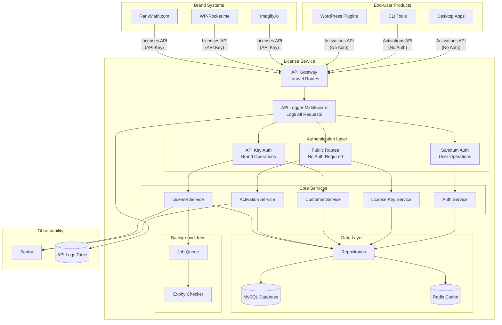
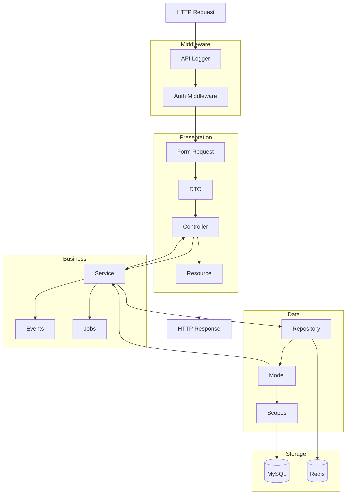
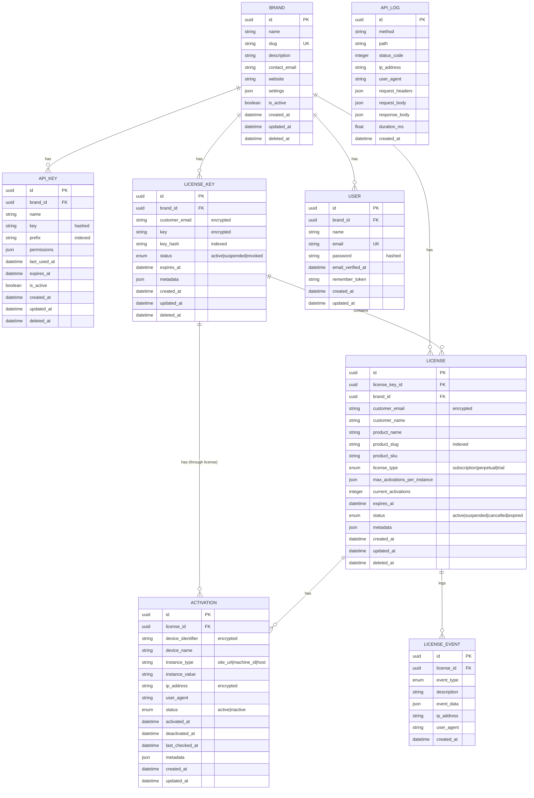
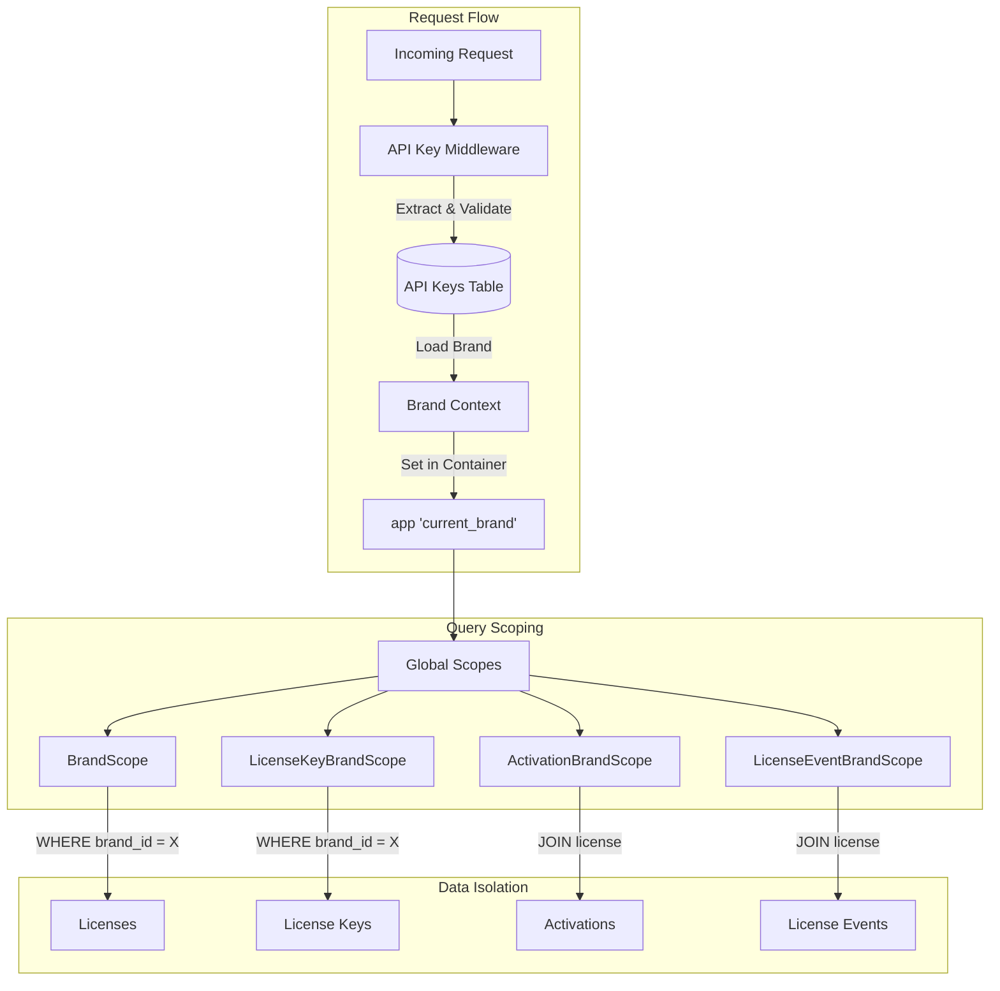
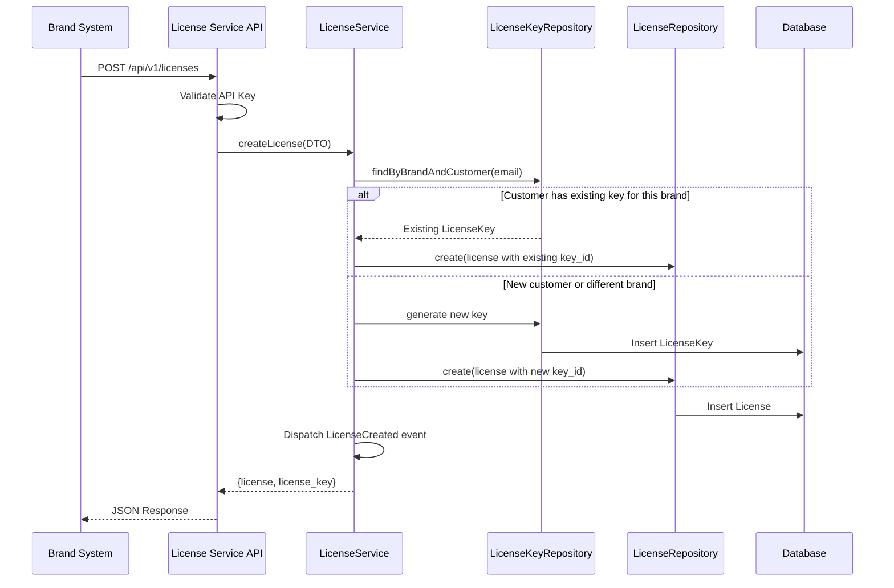

# group.one Centralized License Service

## Table of Contents

1. [Problem Statement and Requirements](#problem-statement-and-requirements)
2. [Architecture and Design](#architecture-and-design)
3. [Code Structure](#code-structure)
4. [Data Model](#data-model)
5. [API Design](#api-design)
6. [Multi-Tenancy Implementation](#multi-tenancy-implementation)
7. [User Stories Implementation](#user-stories-implementation)
8. [Observability and Operability](#observability-and-operability)
9. [Code Quality and Tooling](#code-quality-and-tooling)
10. [Trade-offs and Decisions](#trade-offs-and-decisions)
11. [How to Run Locally](#how-to-run-locally)
12. [API Documentation & Testing Tools](#api-documentation-swaggeropenapi)
13. [Known Limitations and Next Steps](#known-limitations-and-next-steps)

---

## Problem Statement and Requirements

### Overview

group.one is a fast-growing company that acquires and integrates multiple WordPress-focused brands (WP Rocket, Imagify, RankMath, BackWPup, RocketCDN, WP.one, etc.) into a unified ecosystem. A key challenge is knowing, from a single source of truth, which products a given person can access.

### The Solution

This **Centralized License Service** acts as the authoritative system for license lifecycle and entitlements across all brands. Brand-specific systems continue to manage their own users, payments, and billing, but they integrate with this service to:

- **Provision** new licenses when customers make purchases
- **Manage** license lifecycle (renew, suspend, resume, cancel)
- **Query** license status and entitlements

End-user products (WordPress plugins, apps, CLIs) call this service to:

- **Activate** licenses on specific instances (sites, machines)
- **Validate** license status and check entitlements
- **Deactivate** seats when needed

### Core Requirements

1. **Single Source of Truth**: One authoritative system for all license data
2. **Multi-Brand Support**: Complete tenant isolation between brands
3. **Scalable Architecture**: Designed for high-volume operations
4. **Clear API Contracts**: Well-defined endpoints for brand and product integration
5. **Observable & Operable**: Production-ready with logging, monitoring, and error handling

---

## Architecture and Design

### System Architecture



### Application Layers



### Technology Stack

| Component | Technology | Rationale |
|-----------|------------|-----------|
| Framework | Laravel 11.x | Modern PHP, excellent ecosystem, battle-tested |
| Database | MySQL 8.x | ACID compliance, JSON support, proven scalability |
| Cache | Redis | High-performance caching, queue backend |
| Authentication | API Keys + Sanctum | API key for brands, Sanctum for admin users |
| Error Tracking | Sentry | Real-time error monitoring and alerting |
| Code Style | Laravel Pint + PHPCS | PSR-12 compliance, consistent formatting |
| Static Analysis | PHPStan (Level 5) | Catch bugs early, type safety |
| Testing | PHPUnit | Unit, Feature, and E2E tests |
| CI/CD | GitHub Actions | Automated linting, testing, and deployment |
| Containerization | Laravel Sail | Consistent development environment |

### Code Structure

```
app/
├── Console/
│   └── Commands/                    # Artisan commands
│       └── GenerateApiKey.php
├── Constants/                       # Table column constants
│   ├── ActivationConstant.php
│   ├── ApiKeyConstant.php
│   ├── BrandConstant.php
│   ├── LicenseConstant.php
│   ├── LicenseEventConstant.php
│   └── LicenseKeyConstant.php
├── Contracts/
│   └── Repositories/                # Repository interfaces
├── DTOs/                            # Data Transfer Objects
│   ├── CheckActivationStatusDTO.php
│   ├── CreateActivationDTO.php
│   ├── CreateApiKeyDTO.php
│   ├── CreateLicenseDTO.php
│   ├── DeactivationDTO.php
│   ├── GetCustomerLicensesDTO.php
│   ├── LoginDTO.php
│   ├── RegisterDTO.php
│   ├── UpdateBrandDTO.php
│   └── UpdateLicenseDTO.php
├── Docs/                            # OpenAPI/Swagger documentation
│   ├── ActivationDocs.php
│   ├── AuthDocs.php
│   ├── CustomerDocs.php
│   ├── LicenseDocs.php
│   └── OpenApi.php
├── Enums/                           # PHP 8.1 Enums
│   ├── ActivationStatus.php
│   ├── LicenseEventType.php
│   ├── LicenseKeyStatus.php
│   ├── LicenseStatus.php
│   └── LicenseType.php
├── Events/                          # Domain events
│   ├── LicenseActivated.php
│   ├── LicenseCreated.php
│   ├── LicenseDeactivated.php
│   ├── LicenseKeyCreated.php
│   ├── LicenseReactivated.php
│   ├── LicenseRenewed.php
│   ├── LicenseSuspended.php
│   └── LicenseUpdated.php
├── Exceptions/                      # Custom exceptions
│   ├── ApiException.php
│   ├── ApiKey/
│   │   └── ApiKeyNotFoundException.php
│   ├── Auth/
│   │   └── InvalidCredentialsException.php
│   ├── Brand/
│   │   └── BrandNotFoundException.php
│   └── License/
│       ├── ActivationNotFoundException.php
│       ├── InstanceTypeNotConfiguredException.php
│       ├── LicenseCannotActivateException.php
│       ├── LicenseKeyInvalidException.php
│       ├── LicenseKeyNotFoundException.php
│       ├── LicenseNotFoundException.php
│       └── MaxActivationsReachedException.php
├── Http/
│   ├── Controllers/Api/V1/          # API Controllers
│   │   ├── ActivationController.php
│   │   ├── ApiKeyController.php
│   │   ├── AuthController.php
│   │   ├── BrandController.php
│   │   ├── CustomerController.php
│   │   ├── LicenseController.php
│   │   └── LicenseKeyController.php
│   ├── Middleware/                  # HTTP Middleware
│   │   ├── AuthenticateApiKey.php
│   │   └── LogApiRequests.php
│   ├── Requests/                    # Form Request Validation
│   │   ├── ActivateLicenseRequest.php
│   │   ├── CheckActivationStatusRequest.php
│   │   ├── DeactivateLicenseRequest.php
│   │   ├── GetCustomerLicensesRequest.php
│   │   ├── LoginRequest.php
│   │   ├── RegisterRequest.php
│   │   ├── RenewLicenseRequest.php
│   │   ├── StoreApiKeyRequest.php
│   │   ├── StoreLicenseRequest.php
│   │   └── UpdateLicenseRequest.php
│   └── Resources/                   # API Resources (JSON transformers)
│       ├── ActivationResource.php
│       ├── BrandResource.php
│       ├── LicenseKeyResource.php
│       └── LicenseResource.php
├── Jobs/                            # Queue jobs
│   ├── CheckExpiredLicensesJob.php
│   ├── LogApiRequestJob.php
│   └── SendActivationNotificationJob.php
├── Listeners/                       # Event listeners
│   └── LogLicenseEvent.php
├── Models/                          # Eloquent models
│   ├── Activation.php
│   ├── ApiKey.php
│   ├── ApiLog.php
│   ├── Brand.php
│   ├── License.php
│   ├── LicenseEvent.php
│   ├── LicenseKey.php
│   └── User.php
├── PHPStan/Rules/                   # Custom static analysis rules
│   ├── NoUpdateOptionRule.php
│   └── NoVarDumpRule.php
├── Repositories/                    # Data access layer
│   ├── ActivationRepository.php
│   ├── ApiKeyRepository.php
│   ├── BrandRepository.php
│   ├── LicenseKeyRepository.php
│   ├── LicenseRepository.php
│   └── UserRepository.php
├── Scopes/                          # Eloquent global scopes
│   ├── ActivationBrandScope.php
│   ├── BrandScope.php
│   ├── LicenseEventBrandScope.php
│   └── LicenseKeyBrandScope.php
├── Services/                        # Business logic layer
│   ├── ActivationService.php
│   ├── ApiKeyService.php
│   ├── AuthService.php
│   ├── BrandService.php
│   ├── CustomerService.php
│   ├── LicenseEventService.php
│   ├── LicenseKeyService.php
│   └── LicenseService.php
├── Support/
│   └── Logging/
│       └── Sanitizer.php            # Sanitizes sensitive data in logs
└── Traits/                          # Reusable traits
    ├── ApiResponse.php
    ├── DTOToArray.php
    └── HasUuid.php
```

---

## Data Model

### Entity Relationship Diagram



### Key Design Decisions

#### 1. License Keys vs Licenses (One-to-Many Relationship)

A **License Key** is a customer-facing credential that can unlock **multiple Licenses** (products). This design supports the scenario where:

- A RankMath customer gets **one key** that unlocks both "RankMath Pro" and "Content AI" licenses
- The same customer buying WP Rocket gets a **separate key** (different brand)

```
Customer: john@example.com
├── License Key #1 (RankMath brand)
│   ├── License: RankMath Pro
│   └── License: Content AI Addon
└── License Key #2 (WP Rocket brand)
    └── License: WP Rocket
```

#### 2. Instance-Type-Based Seat Management

Instead of a single `max_activations` field, we use `max_activations_per_instance` as a JSON object:

```json
{
  "site_url": 5,
  "machine_id": 2,
  "host": 10
}
```

This allows products to define different seat limits for different instance types (websites vs desktop apps vs CLI tools).

#### 3. Encryption for PII

Sensitive data is encrypted at the database level using Laravel's built-in encryption:

- `customer_email` in licenses
- `device_identifier` in activations
- `ip_address` in activations
- `key` in license_keys

#### 4. Soft Deletes

All major entities support soft deletes, enabling:

- Audit trail preservation
- Data recovery capabilities
- Compliance with data retention policies

---

## API Design

### API Versioning

All endpoints are versioned under `/api/v1/` to ensure backward compatibility as the API evolves.

### Authentication Methods

| Method | Use Case | Header |
|--------|----------|--------|
| None (Public) | License activation, deactivation, status check | - |
| API Key | Brand license management, customer queries | `X-API-Key: {key}` |
| Sanctum Token | Auth endpoints (logout), API key creation | `Authorization: Bearer {token}` |

### Endpoint Overview

#### Public Routes (No Authentication Required)

These endpoints are called by end-user products (WordPress plugins, apps, CLIs) and do not require authentication:

| Method | Endpoint | Description | User Story |
|--------|----------|-------------|------------|
| `POST` | `/api/v1/auth/register` | Register a new user and brand | - |
| `POST` | `/api/v1/auth/login` | Login and get Sanctum token | - |
| `GET` | `/api/v1/license-keys/key/{key}` | Get license key details | US4 |
| `POST` | `/api/v1/activations` | Activate a license | US3 |
| `POST` | `/api/v1/deactivations` | Deactivate a seat | US5 |
| `GET` | `/api/v1/activations/status` | Check license status | US4 |

#### Sanctum Authenticated Routes

These endpoints require a valid Sanctum Bearer token:

| Method | Endpoint | Description |
|--------|----------|-------------|
| `POST` | `/api/v1/auth/logout` | Logout user |
| `POST` | `/api/v1/api-keys` | Create API key for brand |

#### Brand API Endpoints (Require API Key Authentication)

| Method | Endpoint | Description | User Story |
|--------|----------|-------------|------------|
| `GET` | `/api/v1/licenses` | List all licenses (paginated) | US1 |
| `POST` | `/api/v1/licenses` | Create a new license | US1 |
| `GET` | `/api/v1/licenses/{id}` | Get license details | US1 |
| `PUT` | `/api/v1/licenses/{id}` | Update license | US2 |
| `POST` | `/api/v1/licenses/{id}/renew` | Renew license | US2 |
| `POST` | `/api/v1/licenses/{id}/suspend` | Suspend license | US2 |
| `POST` | `/api/v1/licenses/{id}/resume` | Resume suspended license | US2 |
| `POST` | `/api/v1/licenses/{id}/cancel` | Cancel license | US2 |
| `GET` | `/api/v1/customers/licenses` | Get customer's licenses | US6 |

### Request/Response Examples

> **Base URL:** `{{base_url}}` = `http://localhost` (local) or `https://license-api.group.one` (production)

---

#### Auth: Register

**POST** `{{base_url}}/api/v1/auth/register`

**Headers:**
```
Content-Type: application/json
Accept: application/json
```

**Body:**
```json
{
  "name": "John Doe",
  "email": "john@mailinator.com",
  "password": "password123",
  "password_confirmation": "password123",
  "brand_name": "RankMath"
}
```

---

#### Auth: Login

**POST** `{{base_url}}/api/v1/auth/login`

**Headers:**
```
Content-Type: application/json
Accept: application/json
```

**Body:**
```json
{
  "email": "john@mailinator.com",
  "password": "password123"
}
```

---

#### US1: Create License (Provision)

**POST** `{{base_url}}/api/v1/licenses`

**Headers:**
```
X-API-Key: lcs_abc12345.xxxxxxxxxxxxxxxxxxxxxxxxxxxxxxxx
Content-Type: application/json
Accept: application/json
```

**Body:**
```json
{
  "customer_email": "customer@mailinator.com",
  "customer_name": "Jane Smith",
  "product_name": "RankMath Pro",
  "product_slug": "rankmath-pro",
  "license_type": "subscription",
  "max_activations_per_instance": {
    "site_url": 5
  },
  "expires_at": "2026-12-25T00:00:00Z"
}
```

**Response (First purchase - new key generated):**
```json
{
  "success": true,
  "message": "License created successfully",
  "data": {
    "license": {
      "id": "01234567-89ab-cdef-0123-456789abcdef",
      "product_name": "RankMath Pro",
      "product_slug": "rankmath-pro",
      "license_type": "subscription",
      "status": "active",
      "max_activations_per_instance": {"site_url": 5},
      "current_activations": 0,
      "expires_at": "2026-12-25T00:00:00Z",
      "brand": {
        "id": "brand-uuid",
        "name": "RankMath",
        "slug": "rankmath"
      }
    },
    "license_key": "ABCDE-FGHIJ-KLMNO-PQRST-UVWXY"
  }
}
```

---

#### US1: List Licenses

**GET** `{{base_url}}/api/v1/licenses`

**Headers:**
```
X-API-Key: lcs_abc12345.xxxxxxxxxxxxxxxxxxxxxxxxxxxxxxxx
Accept: application/json
```

---

#### US1: Get License Details

**GET** `{{base_url}}/api/v1/licenses/{id}`

**Headers:**
```
X-API-Key: lcs_abc12345.xxxxxxxxxxxxxxxxxxxxxxxxxxxxxxxx
Accept: application/json
```

---

#### US2: Update License

**PUT** `{{base_url}}/api/v1/licenses/{id}`

**Headers:**
```
X-API-Key: lcs_abc12345.xxxxxxxxxxxxxxxxxxxxxxxxxxxxxxxx
Content-Type: application/json
Accept: application/json
```

**Body:**
```json
{
  "customer_name": "Jane Smith Updated",
  "metadata": {
    "notes": "VIP customer"
  }
}
```

---

#### US2: Renew License

**POST** `{{base_url}}/api/v1/licenses/{id}/renew`

**Headers:**
```
X-API-Key: lcs_abc12345.xxxxxxxxxxxxxxxxxxxxxxxxxxxxxxxx
Content-Type: application/json
Accept: application/json
```

**Body:**
```json
{
  "days": 365
}
```

---

#### US2: Suspend License

**POST** `{{base_url}}/api/v1/licenses/{id}/suspend`

**Headers:**
```
X-API-Key: lcs_abc12345.xxxxxxxxxxxxxxxxxxxxxxxxxxxxxxxx
Accept: application/json
```

---

#### US2: Resume License

**POST** `{{base_url}}/api/v1/licenses/{id}/resume`

**Headers:**
```
X-API-Key: lcs_abc12345.xxxxxxxxxxxxxxxxxxxxxxxxxxxxxxxx
Accept: application/json
```

---

#### US2: Cancel License

**POST** `{{base_url}}/api/v1/licenses/{id}/cancel`

**Headers:**
```
X-API-Key: lcs_abc12345.xxxxxxxxxxxxxxxxxxxxxxxxxxxxxxxx
Accept: application/json
```

---

#### US3: Activate License

**POST** `{{base_url}}/api/v1/activations`

**Headers:**
```
Content-Type: application/json
Accept: application/json
```

**Body:**
```json
{
  "license_key": "ABCDE-FGHIJ-KLMNO-PQRST-UVWXY",
  "product_slug": "rankmath-pro",
  "instance_type": "site_url",
  "instance_value": "https://mysite.com",
  "device_name": "My WordPress Site"
}
```

**Response:**
```json
{
  "success": true,
  "message": "License activated successfully",
  "data": {
    "activation": {
      "id": "activation-uuid",
      "instance_type": "site_url",
      "instance_value": "https://mysite.com",
      "status": "active",
      "activated_at": "2024-12-25T10:30:00Z",
      "license": {
        "product_name": "RankMath Pro",
        "product_slug": "rankmath-pro"
      }
    }
  }
}
```

---

#### US4: Check License Status

**GET** `{{base_url}}/api/v1/activations/status?license_key=ABCDE-FGHIJ-KLMNO-PQRST-UVWXY&product_slug=rankmath-pro`

**Headers:**
```
Accept: application/json
```

**Response:**
```json
{
  "success": true,
  "message": "Activation status checked successfully",
  "data": {
    "valid": true,
    "license_type": "subscription",
    "product_name": "RankMath Pro",
    "product_slug": "rankmath-pro",
    "customer_name": "Jane Smith",
    "entitlements": {
      "site_url": {
        "max_seats": 5,
        "used_seats": 1,
        "remaining_seats": 4
      }
    },
    "expires_at": "2026-12-25T00:00:00Z"
  }
}
```

---

#### US4: Get License Key Details

**GET** `{{base_url}}/api/v1/license-keys/key/ABCDE-FGHIJ-KLMNO-PQRST-UVWXY`

**Headers:**
```
Accept: application/json
```

---

#### US5: Deactivate Seat

**POST** `{{base_url}}/api/v1/deactivations`

**Headers:**
```
Content-Type: application/json
Accept: application/json
```

**Body:**
```json
{
  "activation_id": "01234567-89ab-cdef-0123-456789abcdef"
}
```

**Response:**
```json
{
  "success": true,
  "message": "License deactivated successfully",
  "data": []
}
```

---

#### US6: Get Customer Licenses (Brand API)

**GET** `{{base_url}}/api/v1/customers/licenses?email=customer@mailinator.com`

**Headers:**
```
X-API-Key: lcs_abc12345.xxxxxxxxxxxxxxxxxxxxxxxxxxxxxxxx
Accept: application/json
```

**Response:**
```json
{
  "success": true,
  "message": "Customer licenses found",
  "data": {
    "customer_email": "customer@mailinator.com",
    "total_licenses": 2,
    "active_licenses": 2,
    "total_activations": 3,
    "brands": [
      {"id": "brand-uuid", "name": "RankMath", "slug": "rankmath"}
    ],
    "license_key": [
      {
        "id": "license-key-uuid",
        "key": "ABCDE-FGHIJ-KLMNO-PQRST-UVWXY",
        "status": "active",
        "licenses": [
          {"product_name": "RankMath Pro", "status": "active"},
          {"product_name": "Content AI", "status": "active"}
        ],
        "activations": [
          {"instance_value": "https://mysite.com", "status": "active"}
        ]
      }
    ]
  }
}
```

---

#### Create API Key (Sanctum Auth)

**POST** `{{base_url}}/api/v1/api-keys`

**Headers:**
```
Authorization: Bearer {sanctum_token}
Content-Type: application/json
Accept: application/json
```

**Body:**
```json
{
  "name": "Production API Key",
  "permissions": ["licenses:read", "licenses:write"]
}
```

---

## Multi-Tenancy Implementation

### Architecture Overview

The service implements **database-level multi-tenancy** where all brands share the same database but data is isolated through automatic query scoping.



### Implementation Details

#### 1. API Key Authentication Middleware

```php
// app/Http/Middleware/AuthenticateApiKey.php

// After validating the API key, set the brand context:
app()->instance('current_brand', $apiKeyModel->brand);
```

#### 2. Global Query Scopes

Each model that requires brand isolation uses a global scope:

```php
// app/Scopes/BrandScope.php
class BrandScope implements Scope
{
    public function apply(Builder $builder, Model $model): void
    {
        $brand = app()->bound('current_brand') ? app('current_brand') : null;

        if ($brand) {
            $builder->where($model->getTable() . '.brand_id', $brand->id);
        }
    }
}
```

#### 3. Automatic Scope Application

Models automatically apply their scopes:

```php
// app/Models/License.php
protected static function booted(): void
{
    static::addGlobalScope(new BrandScope());
}
```

### Brand Isolation Guarantees

| Aspect | Implementation |
|--------|----------------|
| **Licenses** | `BrandScope` filters by `brand_id` |
| **License Keys** | `LicenseKeyBrandScope` filters by `brand_id` |
| **Activations** | `ActivationBrandScope` joins through `license` to filter by brand |
| **License Events** | `LicenseEventBrandScope` joins through `license` to filter by brand |
| **API Keys** | Each brand has separate API keys |

### Cross-Brand Data Access

For administrative purposes (super admin), the scopes can be bypassed:

```php
if ($user->isSuperAdmin()) {
    return; // No filtering applied
}
```

---

## User Stories Implementation

### Implementation Status Summary

| User Story | Status | Implementation |
|------------|--------|----------------|
| US1: Brand can provision a license | ✅ **Implemented** | Full API + Service Layer |
| US2: Brand can change license lifecycle | ✅ **Implemented** | Renew/Suspend/Resume/Cancel endpoints |
| US3: End-user product can activate a license | ✅ **Implemented** | Full activation with seat limits |
| US4: User can check license status | ✅ **Implemented** | Status endpoint with entitlements |
| US5: End-user product can deactivate a seat | ✅ **Implemented** | Deactivation endpoint |
| US6: Brands can list licenses by customer email | ✅ **Implemented** | Customer lookup endpoint |

### US1: Brand Can Provision a License

**Implementation Details:**

1. **Endpoint**: `POST /api/v1/licenses`
2. **Controller**: `App\Http\Controllers\Api\V1\LicenseController@store`
3. **Service**: `App\Services\LicenseService@createLicense`
4. **DTO**: `App\DTOs\CreateLicenseDTO`

**Flow:**



**Key Scenario (from requirements):**

> A RankMath customer buys RankMath → gets License Key #1
> Same customer buys Content AI (RankMath addon) → added to Key #1
> Same customer buys WP Rocket (different brand) → gets new Key #2

This is handled by checking if a license key already exists for the customer email within the same brand:

```php
// LicenseService.php
$existingLicenseKey = $this->licenseKeyRepository->findByBrandAndCustomer(
    $dto->getCustomerEmail()
);

if ($existingLicenseKey) {
    $licenseKeyId = $existingLicenseKey->id;
    $plainKey = null; // Don't return key again
} else {
    // Generate new key for new customer/brand combination
    $licenseKeyData = $this->generateLicenseKeyForCustomer(...);
    $plainKey = $licenseKeyData['plain_key']; // Return new key to brand
}
```

### US2: Brand Can Change License Lifecycle

**Implementation Details:**

| Action | Endpoint | Method |
|--------|----------|--------|
| Renew | `POST /api/v1/licenses/{id}/renew` | `LicenseController@renew` |
| Suspend | `POST /api/v1/licenses/{id}/suspend` | `LicenseController@suspend` |
| Resume | `POST /api/v1/licenses/{id}/resume` | `LicenseController@resume` |
| Cancel | `POST /api/v1/licenses/{id}/cancel` | `LicenseController@cancel` |

**Service Methods:**

```php
// LicenseService.php

public function renewLicense(License $license, int $days): License
{
    $newExpiryDate = now()->addDays($days);
    $updated = $this->updateLicense($license, [
        'expires_at' => $newExpiryDate,
        'status' => LicenseStatus::ACTIVE->value,
    ]);
    LicenseRenewed::dispatch($updated, "License renewed for {$days} days");
    return $updated;
}

public function suspendLicense(License $license): License
{
    $updated = $this->updateLicense($license, ['status' => LicenseStatus::SUSPENDED->value]);
    LicenseSuspended::dispatch($updated, 'License suspended');
    return $updated;
}

public function reactivateLicense(License $license): License
{
    $updated = $this->updateLicense($license, ['status' => LicenseStatus::ACTIVE->value]);
    LicenseReactivated::dispatch($updated, 'License reactivated');
    return $updated;
}
```

### US3: End-User Product Can Activate a License

**Implementation Details:**

1. **Endpoint**: `POST /api/v1/activations` (Public - no API key required)
2. **Controller**: `App\Http\Controllers\Api\V1\ActivationController@store`
3. **Service**: `App\Services\ActivationService@activate`

**Seat Enforcement Logic:**

```php
// ActivationService.php

// 1. Get max seats for the instance type
$maxForType = $license->max_activations_per_instance[$instanceType] ?? null;

if ($maxForType === null) {
    throw new InstanceTypeNotConfiguredException($instanceType);
}

// 2. Check for existing activation (idempotency)
$existingActivation = $this->activationRepository->findByInstanceTypeAndValue(
    $license->id, $instanceType, $instanceValue
);

if ($existingActivation) {
    $existingActivation->updateLastChecked();
    return $existingActivation; // Return existing, don't consume new seat
}

// 3. Count unique active instances
$currentUniqueValues = $this->activationRepository->countUniqueActiveInstanceValues(
    $license->id, $instanceType
);

// 4. Enforce seat limit
if ($currentUniqueValues >= $maxForType) {
    throw new MaxActivationsReachedException($instanceType, $maxForType);
}

// 5. Create activation
return $this->activationRepository->create([...]);
```

### US4: User Can Check License Status

**Implementation Details:**

1. **Endpoint**: `GET /api/v1/activations/status` (Public)
2. **Controller**: `App\Http\Controllers\Api\V1\ActivationController@status`
3. **Service**: `App\Services\ActivationService@checkStatus`

**Response includes:**
- License validity
- License type (subscription/perpetual/trial)
- Product information
- Entitlements with seat counts per instance type
- Expiration date

### US5: End-User Product Can Deactivate a Seat

**Implementation Details:**

1. **Endpoint**: `POST /api/v1/deactivations` (Public)
2. **Controller**: `App\Http\Controllers\Api\V1\ActivationController@deactivate`
3. **Service**: `App\Services\ActivationService@deactivate`

```php
// ActivationService.php
public function deactivate(Activation $activation): void
{
    DB::transaction(function () use ($activation) {
        $license = $activation->license;

        $activation->deactivate(); // Sets status=inactive, deactivated_at=now
        $license->decrementActivations();

        LicenseDeactivated::dispatch($license, $activation, "License deactivated...");
    });
}
```

### US6: Brands Can List Licenses by Customer Email

**Implementation Details:**

1. **Endpoint**: `GET /api/v1/customers/licenses?email={email}` (API Key required)
2. **Controller**: `App\Http\Controllers\Api\V1\CustomerController@licenses`
3. **Service**: `App\Services\CustomerService@getCustomerSummary`

**Brand Isolation:**

The endpoint automatically scopes results to the authenticated brand via `LicenseKeyBrandScope`. Brand A cannot see Brand B's licenses even for the same customer email.

```php
// CustomerService.php
public function getCustomerSummary(string $email): array
{
    // LicenseKeyBrandScope automatically filters by current brand
    $licenseKeys = $this->getLicenseKeysByEmail($email);
    $licenseKeys->load(['licenses', 'activations', 'brand']);

    return [
        'customer_email' => $email,
        'total_licenses' => $licenseKeys->sum(fn($key) => $key->licenses->count()),
        'active_licenses' => ...,
        'total_activations' => ...,
        'brands' => BrandResource::collection($brands),
        'license_key' => LicenseKeyResource::collection($licenseKeys),
    ];
}
```

---

## Observability and Operability

### Logging and Monitoring

#### 1. Sentry Integration

Sentry is configured for real-time error tracking and performance monitoring:

```php
// config/sentry.php
return [
    'dsn' => env('SENTRY_LARAVEL_DSN'),
    'sample_rate' => 1.0,
    'traces_sample_rate' => env('SENTRY_TRACES_SAMPLE_RATE'),

    'breadcrumbs' => [
        'logs' => true,
        'sql_queries' => true,
        'queue_info' => true,
        'http_client_requests' => true,
    ],

    'tracing' => [
        'queue_job_transactions' => true,
        'sql_queries' => true,
        'http_client_requests' => true,
    ],
];
```

**Features:**
- Automatic exception capture
- Performance tracing for API requests
- SQL query monitoring
- Queue job tracking
- Breadcrumbs for debugging

#### 2. API Request Logging

All API requests are logged via middleware with sensitive data sanitization:

```php
// app/Http/Middleware/LogApiRequests.php
// Dispatches LogApiRequestJob to store request/response in api_logs table

// app/Support/Logging/Sanitizer.php
// Redacts sensitive fields: password, token, api_key, license_key, etc.
// Masks email addresses for privacy
```

**Logged Data:**
- Correlation ID (for tracing)
- Method, path, full URL
- Request/response headers (sanitized)
- Request/response body (sanitized)
- Status code
- Duration in milliseconds
- Brand ID

#### 3. Event-Driven Audit Trail

All license lifecycle events are logged to the `license_events` table:

```php
// app/Events/ - Available events:
// - LicenseCreated
// - LicenseUpdated
// - LicenseActivated
// - LicenseDeactivated
// - LicenseSuspended
// - LicenseReactivated
// - LicenseRenewed
// - LicenseKeyGenerated
// - LicenseKeyCreated

// app/Listeners/LogLicenseEvent.php
// Creates LicenseEvent records for each event type
```

### Background Jobs

| Job | Description | Trigger |
|-----|-------------|---------|
| `CheckExpiredLicensesJob` | Marks expired licenses as expired | Scheduled or via `licenses:check-expired` command |
| `LogApiRequestJob` | Async logging of API requests | Every API request via middleware |
| `ProcessLicenseProvisioningJob` | Bulk license key generation | Manual dispatch |
| `SendActivationNotificationJob` | Send activation notifications | After activation events |

### Artisan Commands

| Command | Description |
|---------|-------------|
| `sail artisan apikey:generate {brand} {name}` | Generate API key for a brand |
| `sail artisan licenses:check-expired` | Check and mark expired licenses |

**Example: Generate API Key**

```bash
sail artisan apikey:generate rankmath "Production API Key" --expires-in=365

# Output:
# ✓ API Key generated successfully!
#
# | Field      | Value                           |
# |------------|--------------------------------|
# | ID         | uuid-here                       |
# | Brand      | RankMath (ID: brand-uuid)       |
# | Name       | Production API Key              |
# | Prefix     | lcs_aBc12345                    |
# | Expires At | 2025-12-25 00:00:00            |
#
# ⚠ IMPORTANT: Save this API key securely. It will not be shown again!
#
# API Key: lcs_aBc12345.xxxxxxxxxxxxxxxxxxxxxxxxxxxxxxxxxxx
```

### Error Handling

Custom exceptions provide meaningful error responses:

```
app/Exceptions/
├── ApiException.php                     # Base exception class
├── ApiKey/
│   └── ApiKeyNotFoundException.php
├── Auth/
│   └── InvalidCredentialsException.php
├── Brand/
│   └── BrandNotFoundException.php
└── License/
    ├── ActivationNotFoundException.php
    ├── InstanceTypeNotConfiguredException.php
    ├── LicenseCannotActivateException.php
    ├── LicenseKeyInvalidException.php
    ├── LicenseKeyNotFoundException.php
    ├── LicenseKeyNotValidException.php
    ├── LicenseNotFoundException.php
    ├── LicenseNotFoundForProductException.php
    └── MaxActivationsReachedException.php
```

**Error Response Format:**

```json
{
  "success": false,
  "message": "Maximum activations reached for site_url (limit: 5)",
  "error": {
    "code": "MAX_ACTIVATIONS_REACHED",
    "instance_type": "site_url",
    "max_allowed": 5
  }
}
```

---

## Code Quality and Tooling

### Code Style: Laravel Pint + PHPCS

**Laravel Pint** (PSR-12 compatible formatter):

```bash
# Format code
composer pint

# Check formatting without changes
composer pint:test
```

**PHP CodeSniffer** (Additional linting):

```xml
<!-- phpcs.xml -->
<ruleset name="group.one Centralized License Service Coding Standard">
    <file>app</file>
    <file>database</file>
    <file>routes</file>

    <rule ref="PSR12"/>

    <!-- Exclude migrations from strict checking -->
    <exclude-pattern>database/migrations/*</exclude-pattern>
</ruleset>
```

```bash
# Run linting
composer phpcs

# Auto-fix issues
composer phpcbf
```

### Static Analysis: PHPStan

PHPStan is configured at **Level 5** with custom rules:

```yaml
# phpstan.neon
includes:
    - ./vendor/larastan/larastan/extension.neon
    - phpstan-baseline.neon

rules:
    - App\PHPStan\Rules\NoVarDumpRule      # Prevent var_dump in code
    - App\PHPStan\Rules\NoUpdateOptionRule # Prevent direct option updates

parameters:
    paths:
        - app
        - database
        - routes
    level: 5
```

```bash
# Run static analysis
composer phpstan
```

**Custom Rules:**

```php
// app/PHPStan/Rules/NoVarDumpRule.php
// Prevents accidental var_dump/dd calls in production code

// app/PHPStan/Rules/NoUpdateOptionRule.php
// Prevents direct database option updates (enforce service layer)
```

### Testing

**Test Structure:**

```
tests/
├── Unit/
│   └── Services/
│       ├── ActivationServiceTest.php
│       └── LicenseServiceTest.php
├── Feature/
│   └── Api/V1/
│       ├── ActivationApiTest.php
│       ├── CustomerApiTest.php
│       ├── LicenseApiTest.php
│       ├── LicenseKeyApiTest.php
│       └── MultiTenancyIsolationTest.php
├── E2E/
│   └── LicenseLifecycleE2ETest.php
└── Traits/
    ├── WithApiKey.php
    └── WithSanctumAuth.php
```

**Run Tests:**

```bash
# Run all tests
sail test

# Run with coverage
sail composer test:coverage

# Run specific test
sail test --filter=LicenseLifecycleE2ETest
```

### Continuous Integration (GitHub Actions)

The CI/CD pipeline is configured in `.github/workflows/ci.yml`:

**Pipeline Steps:**

1. **Checkout Code** - Uses `actions/checkout@v4`
2. **Setup PHP** - PHP 8.2 with required extensions
3. **Install Dependencies** - Composer install
4. **Copy .env** - Set up environment configuration
5. **Start Laravel Sail** - Boot the containerized environment
6. **Wait for MySQL** - Ensure database is ready
7. **Run Migrations & Seeders** - Set up database schema
8. **Validate PR Description** - Ensures meaningful PR descriptions (min 20 chars)
9. **Check PR Task List** - Uses `wp-media/pr-checklist-action`
10. **Execute Tests** - Run PHPUnit test suite via Sail
11. **Generate Coverage Report** - Create coverage.xml report
12. **Install diff-cover** - Python tool for diff coverage
13. **Run Diff Coverage** - Fail if new code has < 50% coverage
14. **Run Static Analysis** - PHPStan analysis
15. **Upload Coverage to Codacy** - Send coverage reports to Codacy

**Required GitHub Secrets:**

| Secret | Description |
|--------|-------------|
| `APP_KEY` | Laravel application encryption key |
| `CODACY_PROJECT_TOKEN` | Token for Codacy coverage uploads |
| `GITHUB_TOKEN` | Auto-provided for PR checklist action |

**Setting Up Secrets:**

1. Go to your GitHub repository → Settings → Secrets and variables → Actions
2. Add the following secrets:
   - `APP_KEY`: Generate with `sail artisan key:generate --show`
   - `CODACY_PROJECT_TOKEN`: Get from Codacy project settings → Coverage → Project API Token

**Trigger Events:**
- `push` to `develop` branch
- `pull_request` targeting `develop` branch

### Quality Script

Run all quality checks at once:

```bash
composer quality

# Runs:
# 1. composer phpcs      (linting)
# 2. composer phpstan    (static analysis)
# 3. composer test       (tests)
```

---

## Trade-offs and Decisions

### 1. Database-Level Multi-Tenancy vs Schema/Database Separation

**Decision:** Database-level tenancy with global query scopes

**Alternatives Considered:**
- **Separate databases per brand**: Maximum isolation but complex to manage, hard to query across brands
- **Schema separation**: PostgreSQL-specific, migration complexity

**Trade-offs:**
- ✅ Simpler infrastructure (single database)
- ✅ Easier cross-brand analytics (with scope bypass for admin)
- ✅ Faster onboarding of new brands
- ⚠️ Requires careful scope implementation
- ⚠️ Must audit all queries for proper scoping

### 2. One License Key → Multiple Licenses

**Decision:** One-to-many relationship between license keys and licenses

**Rationale:**
- Matches the user story requirement (RankMath key unlocks RankMath + Content AI)
- Better UX for customers (fewer keys to manage)
- Enables bundle products

**Trade-offs:**
- ✅ Customer convenience
- ⚠️ More complex activation logic (must specify product_slug)

### 3. Instance-Type-Based Seat Limits

**Decision:** JSON field `max_activations_per_instance` instead of single integer

**Rationale:**
- Products have different instance types (sites vs machines vs hosts)
- Same license might have different limits per type

**Trade-offs:**
- ✅ Flexible for diverse products
- ⚠️ Slightly more complex seat counting logic

### 4. API Key Authentication vs OAuth2

**Decision:** Simple API key authentication for brand integrations

**Rationale:**
- Simpler to implement and use
- Brands don't need OAuth flows for server-to-server calls
- API keys can be easily rotated

**Trade-offs:**
- ✅ Simple integration
- ✅ No token refresh needed
- ⚠️ Less granular permissions than OAuth scopes
- ⚠️ Key exposure risks (mitigated by hashing, HTTPS)

### 5. Synchronous vs Asynchronous License Creation

**Decision:** Synchronous API response with async event logging

**Rationale:**
- Brands need immediate confirmation of license creation
- Event logging can be async (doesn't block response)

**Trade-offs:**
- ✅ Immediate feedback
- ✅ Consistent state
- ⚠️ Slightly longer response times

### Scaling Plan

#### Short-term (Current → 10K requests/minute)

- Read replicas for database
- Redis caching for license key lookups
- Horizontal scaling with load balancer

#### Medium-term (10K → 100K requests/minute)

- Database sharding by brand
- CDN for static responses
- Queue scaling with dedicated workers

#### Long-term (100K+ requests/minute)

- Consider separate microservices for activation vs provisioning
- Event sourcing for audit trail
- Global distribution with regional databases

---

## Additional Features (Not Exposed via API)

Some features exist in the codebase but are not currently exposed via API endpoints as they were not part of the user stories. Below are notable examples:

### 1. Brand Management

The `Brand` model and `BrandService` exist for managing brands, but brand CRUD endpoints are not exposed. Brands are currently created via database seeding or direct database access.

### 2. License Key Listing

`LicenseKeyController@index` and `@show` exist but are not currently routed, as listing keys was not in the user stories.

### 3. Additional Controller Methods

Various controller methods exist for potential future use (e.g., batch operations, advanced filtering). These can be exposed via routes as requirements evolve.

> **Note:** The codebase contains additional services, repositories, and helper classes that support extensibility. Explore the `app/` directory for the complete implementation.

---

## How to Run Locally

This project uses **Laravel Sail** for local development, providing a consistent containerized environment.

### Prerequisites

- Docker Desktop (Windows/macOS) or Docker Engine (Linux)
- WSL2 (Windows only)
- Composer 2.x (for initial install only)
- PHP 8.2+ (for initial composer install only)
- Laravel 11.x
- MySQL 8.x

### Setting Up Sail Alias

Add this alias to your shell configuration file (`~/.bashrc`, `~/.zshrc`, or `~/.profile`):

```bash
# Add to ~/.bashrc or ~/.zshrc
alias sail='[ -f sail ] && sh sail || sh vendor/bin/sail'
```

Reload your shell:

```bash
source ~/.bashrc  # or source ~/.zshrc
```

Now you can use `sail` instead of `./vendor/bin/sail`.

### Quick Start

```bash
# 1. Clone the repository
git clone https://github.com/abdulsamad245/group.one-technical-assessment.git
cd group.one-technical-assessment

# 2. Copy environment file
cp .env.example .env

# 3. Install dependencies (first time only)
composer install

# 4. Start Laravel Sail
sail up -d

# 5. Generate application key
sail artisan key:generate

# 6. Run migrations
sail artisan migrate

# 7. Seed test data (optional)
sail artisan db:seed

# 8. Generate an API key for testing
sail artisan apikey:generate rankmath "Test API Key"
```

### Common Sail Commands

```bash
# Start containers
sail up -d

# Stop containers
sail down

# View logs
sail logs

# Access MySQL CLI
sail mysql

# Access Redis CLI
sail redis

# Run Composer commands
sail composer install
sail composer require package/name

# Run Artisan commands
sail artisan migrate
sail artisan db:seed
sail artisan cache:clear

# Run PHPUnit tests
sail test

# Run specific test
sail test --filter=LicenseServiceTest

# Access container shell
sail shell

# Run npm commands
sail npm install
sail npm run dev
```

### Environment Variables

The `.env.example` file contains all the environment variables needed to run the application:

```env
APP_NAME="group.one Centralized License Service"
APP_ENV=local
APP_KEY=
APP_DEBUG=true
APP_TIMEZONE=UTC
APP_URL=http://localhost

APP_LOCALE=en
APP_FALLBACK_LOCALE=en
APP_FAKER_LOCALE=en_US

APP_MAINTENANCE_DRIVER=file
APP_MAINTENANCE_STORE=database

BCRYPT_ROUNDS=12

LOG_CHANNEL=stack
LOG_STACK=single
LOG_DEPRECATIONS_CHANNEL=null
LOG_LEVEL=debug

DB_CONNECTION=mysql
DB_HOST=mysql
DB_PORT=3306
DB_DATABASE=license_service
DB_USERNAME=sail
DB_PASSWORD=password

SESSION_DRIVER=database
SESSION_LIFETIME=120
SESSION_ENCRYPT=false
SESSION_PATH=/
SESSION_DOMAIN=null

BROADCAST_CONNECTION=log
FILESYSTEM_DISK=local
QUEUE_CONNECTION=redis

CACHE_STORE=redis
CACHE_PREFIX=

MEMCACHED_HOST=127.0.0.1

REDIS_CLIENT=phpredis
REDIS_HOST=redis
REDIS_PASSWORD=null
REDIS_PORT=6379

MAIL_MAILER=log
MAIL_HOST=127.0.0.1
MAIL_PORT=2525
MAIL_USERNAME=null
MAIL_PASSWORD=null
MAIL_ENCRYPTION=null
MAIL_FROM_ADDRESS="hello@mailinator.com"
MAIL_FROM_NAME="${APP_NAME}"

AWS_ACCESS_KEY_ID=
AWS_SECRET_ACCESS_KEY=
AWS_DEFAULT_REGION=us-east-1
AWS_BUCKET=
AWS_USE_PATH_STYLE_ENDPOINT=false

VITE_APP_NAME="${APP_NAME}"

# Swagger Configuration
L5_SWAGGER_GENERATE_ALWAYS=true
L5_SWAGGER_CONST_HOST=http://localhost/api/v1

# License Service Configuration
LICENSE_KEY_LENGTH=32
LICENSE_ACTIVATION_LIMIT=5
LICENSE_DEFAULT_DURATION_DAYS=365

# Sentry Configuration (optional)
SENTRY_LARAVEL_DSN=
SENTRY_TRACES_SAMPLE_RATE=1.0
SENTRY_PROFILES_SAMPLE_RATE=1.0
```

### Running Tests

```bash
# Run all tests
sail test

# Run with coverage
sail php vendor/bin/phpunit --coverage-html coverage

# Run specific test file
sail test tests/Feature/Api/V1/LicenseApiTest.php

# Run specific test method
sail test --filter=test_can_create_license
```

### Running Quality Checks

```bash
# Run all quality checks
composer run quality

# Run individual checks
composer run pint        # Code formatting
composer run pint:test   # Check formatting without changes
composer run phpstan     # Static analysis
composer run phpcs       # PHP CodeSniffer
```

### API Documentation (Swagger/OpenAPI)

The API documentation is generated using **L5-Swagger** (OpenAPI 3.0).

**Generate Documentation:**

```bash
sail artisan l5-swagger:generate
```

**Access Documentation:**

Once the service is running, access the interactive Swagger UI at:

| Environment | URL |
|-------------|-----|
| Local (Sail) | [http://localhost/api/docs](http://localhost/api/docs) |
| Production | `https://your-domain.com/api/docs` |

The Swagger UI allows you to:
- Browse all available endpoints
- View request/response schemas
- Test API calls directly from the browser
- Download the OpenAPI JSON specification

**OpenAPI JSON Specification:**

```
http://localhost/api/docs/api-docs.json
```

> **Note:** Replace `localhost` with your domain in production environments.

### Postman Collection

A ready-to-import Postman collection is included in the repository for quick API testing.

**File:** `postman.json`

**Import Instructions:**

1. Open Postman
2. Click **Import** (top-left)
3. Drag and drop `postman.json` or click **Upload Files**
4. The collection "License Service API" will be added

**Collection Variables:**

After importing, configure the following variables in the collection settings:

| Variable | Description | Default Value |
|----------|-------------|---------------|
| `base_url` | API base URL | `http://localhost` |
| `api_key` | Brand API key (from `sail artisan apikey:generate`) | - |
| `sanctum_token` | User auth token (from login response) | - |
| `license_id` | License UUID for testing | - |
| `activation_id` | Activation UUID for testing | - |
| `license_key` | License key for activation tests | - |

**Collection Structure:**

```
License Service API/
├── Auth/
│   ├── Register
│   ├── Login
│   └── Logout
├── API Keys/
│   └── Create API Key
├── Licenses/
│   ├── List Licenses
│   ├── Create License
│   ├── Get License
│   ├── Update License
│   ├── Renew License
│   ├── Suspend License
│   ├── Resume License
│   └── Cancel License
├── Activations/
│   ├── Activate License
│   ├── Check License Status
│   └── Deactivate License
├── License Keys/
│   └── Get License Key by Key
└── Customers/
    └── Get Customer Licenses
```

**Quick Start with Postman:**

```bash
# 1. Start the service
sail up -d

# 2. Generate an API key
sail artisan apikey:generate rankmath "Postman Testing"
# Copy the output API key

# 3. Import postman.json into Postman

# 4. Set the api_key variable to the generated key

# 5. Execute "Create License" to create a test license

# 6. Copy the license_id and license_key from the response

# 7. Test activation flow with "Activate License"
```

---

## Known Limitations and Next Steps

### Current Limitations

1. **No Webhook Notifications**: Brands aren't notified of license events. Consider implementing webhooks for:
   - License expiration warnings
   - Activation/deactivation events
   - Status changes

2. **No Bulk Operations**: Current API handles single operations. Bulk endpoints for provisioning multiple licenses would be valuable.

3. **No License Transfer**: Customers cannot transfer licenses between email addresses.

4. **No Grace Period**: Expired licenses immediately lose validity. Consider adding grace periods.

5. **No Usage Analytics**: No built-in analytics for license usage patterns.

### Recommended Next Steps

1. **Custom Rate Limiting per Endpoint**

   Global rate limiting is configured (60 requests/minute per API key or IP). For production, consider customizing per endpoint:
   ```php
   // Current global configuration in RouteServiceProvider
   RateLimiter::for('api', function (Request $request) {
       $identifier = $request->input('api_key_id') ?: $request->ip();
       return Limit::perMinute(60)->by($identifier);
   });

   // Custom per-endpoint limits can be added as needed
   RateLimiter::for('activations', fn() => Limit::perMinute(30));
   ```

2. **Webhook System**
   - Create `WebhookEndpoint` model for brand webhook URLs
   - Queue webhook deliveries for reliability
   - Implement retry logic with exponential backoff

3. **Admin Dashboard**
   - Leverage existing Sanctum auth
   - Build Vue.js/React frontend
   - Brand management UI
   - License analytics

4. **Caching Layer**
   ```php
   // Cache license key lookups
   Cache::remember("license_key:{$keyHash}", 3600, fn() => ...);
   ```

5. **Audit Log UI**
   - Expose license events via API for brand admins
   - Build timeline view of license lifecycle

6. **Prometheus Metrics**
   - Add `/metrics` endpoint for monitoring
   - Track: requests/sec, license counts, activation rates

---

## Summary

This Centralized License Service provides a robust, scalable, and well-architected solution for managing licenses across multiple brands. All six user stories have been fully implemented with:

- ✅ Complete API coverage
- ✅ Multi-tenant data isolation
- ✅ Instance-type-based seat management
- ✅ Comprehensive event logging
- ✅ Production-ready error handling
- ✅ Full test coverage
- ✅ CI/CD pipeline
- ✅ Code quality tooling (Pint, PHPCS, PHPStan)
- ✅ Sentry integration for observability
- ✅ Swagger/OpenAPI documentation
- ✅ Postman collection for API testing

The codebase follows Laravel best practices with clean separation of concerns through Controllers, Services, Repositories, DTOs, and Events.
